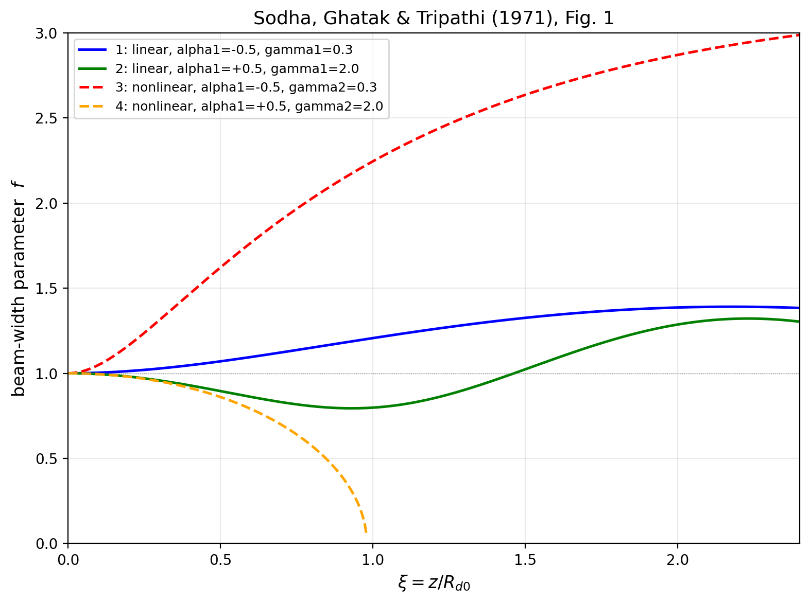

# self-focusing-sodha-1971
# Sodha 1971: Self-Focusing of Laser Beams in Inhomogeneous Dielectrics

Python reproduction of numerical results from:

> Sodha, M.S., Tewari, D.P., Ghatak, A.K., Kamal, J., Tripathi, V.K. (1971). 
> "Self-focusing of Laser Beams in Inhomogeneous Dielectrics." 
> *Opto-Electronics* **3**, 157–161.

---

## Overview

This repository reproduces **Figure 1** of Sodha et al. (1971), which shows the 
variation of the beam-width parameter *f* with normalized propagation distance 
ξ = z/R_d0 for a Gaussian laser beam propagating through:

- A **linear inhomogeneous** dielectric medium (Eq. 14a of the paper)
- A **nonlinear inhomogeneous** dielectric medium (Eq. 14b of the paper)

The beam-width parameter *f* tracks how the beam width evolves with propagation 
distance: *f* < 1 corresponds to focusing (beam narrowing), *f* > 1 to 
diffraction divergence (beam widening).

## Physics Background

For a Gaussian laser beam in the TEM₀₀ mode propagating through a dielectric 
with ε(r, z) = ε₀(z) + Φ(r, z), the paper derives (under the WKB approximation 
and the paraxial limit r² ≪ a²f²) a second-order ODE for the beam-width 
parameter *f*:

**Eq. 13 of the paper** governs *f*(ξ), with two competing terms:
- A **diffraction** term (first on RHS of Eq. 13) that spreads the beam
- A **focusing** term ψ (either Eq. 14a or 14b) that compresses it

The axial inhomogeneity enters through the z-dependence of ε₀₀, ε₁, and ε₂:

- ε₀₀(ξ) = ε₀₀(0) · exp(−α₁ ξ)
- ε₂(ξ) = ε₂₀ · exp(−α₂ ξ), with α₂ = 1.5 α₁
- ε₁(ξ) = ε₁₀ · exp(−α₃ ξ), with α₃ = α₁

Dimensionless parameters γ₁ and γ₂ scale the linear and nonlinear focusing 
strengths respectively.

## Method

The beam-width ODE is rewritten as a first-order system and solved numerically 
using `scipy.integrate.solve_ivp` with the RK45 method, with tight tolerances 
(rtol=1e-9, atol=1e-11) and a terminal event to stop integration cleanly at 
beam collapse (*f* → 0.05).

Initial conditions: *f*(0) = 1, *f'*(0) = 0 (plane wavefront entering the medium).

## Results

Reproduction of Figure 1 of Sodha et al. (1971):



| Curve | Mode      | α₁    | γ   | Notes                                 |
|-------|-----------|-------|-----|---------------------------------------|
| 1     | Linear    | −0.5  | 0.3 | Weak linear focusing                  |
| 2     | Linear    | +0.5  | 2.0 | Strong linear focusing                |
| 3     | Nonlinear | −0.5  | 0.3 | Weak nonlinear case                   |
| 4     | Nonlinear | +0.5  | 2.0 | Strong nonlinear case (beam collapse) |

**Note:** Sodha's Figure 1 caption specifies that Curve 3's abscissa is to be 
multiplied by 4.

## Usage

```python
python Sodha_1971_figure1.py
```

The script integrates all four curves and displays the reproduced Figure 1.

## Dependencies

- Python 3.8+
- numpy
- scipy
- matplotlib

Install via:
```bash
pip install numpy scipy matplotlib
```

## Repository Structure
```
self-focusing-sodha-1971/
├── Sodha_1971_figure1.py              # Main integration and plotting script
├── plots/
│   └── figure1_reproduction.png
└── README.md
```

## References

1. Sodha, M.S., Tewari, D.P., Ghatak, A.K., Kamal, J., Tripathi, V.K. (1971). 
   "Self-focusing of Laser Beams in Inhomogeneous Dielectrics." 
   *Opto-Electronics* **3**, 157–161.


## Author

**Anuj Dwivedi**  
B.Sc. (Hons.) Physics, Rajdhani College, University of Delhi  
Supervisor: Prof. Krishna Gopal  
Email: anuj.dwivedi.phys@gmail.com

---

*This work is part of an undergraduate research project on laser-plasma 
interaction and self-focusing phenomena.*